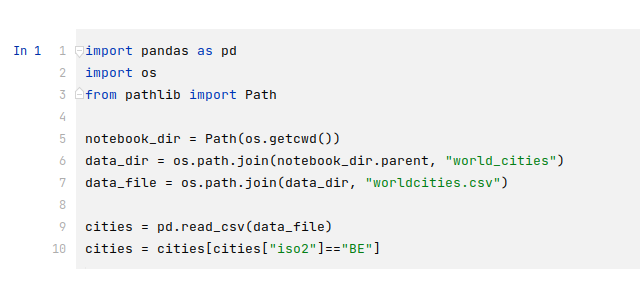
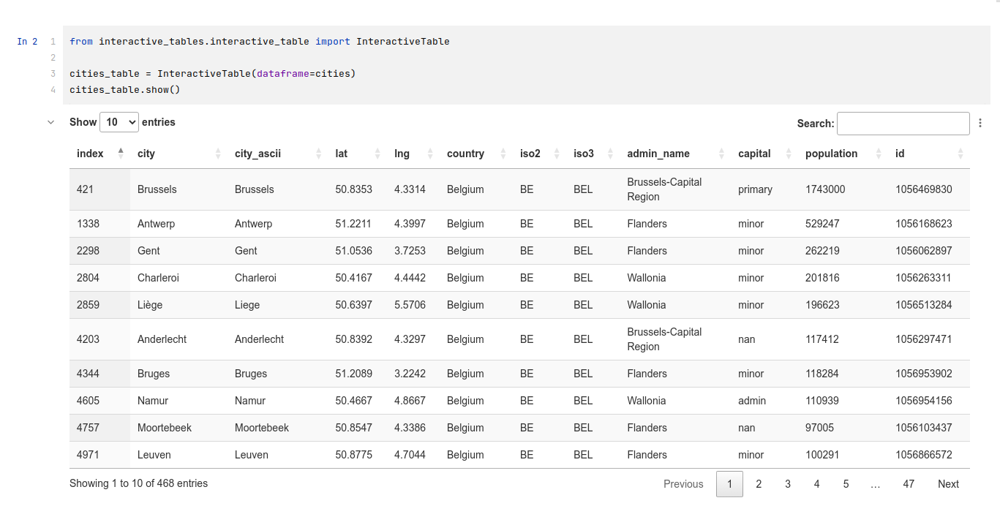
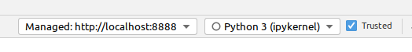
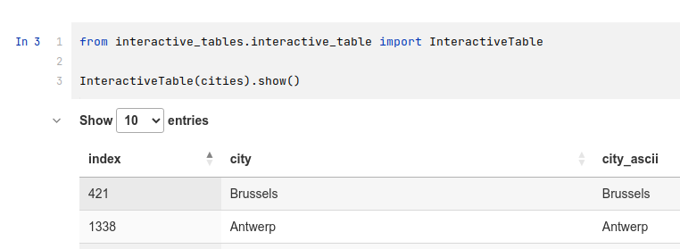
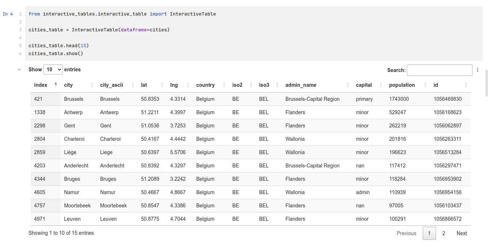
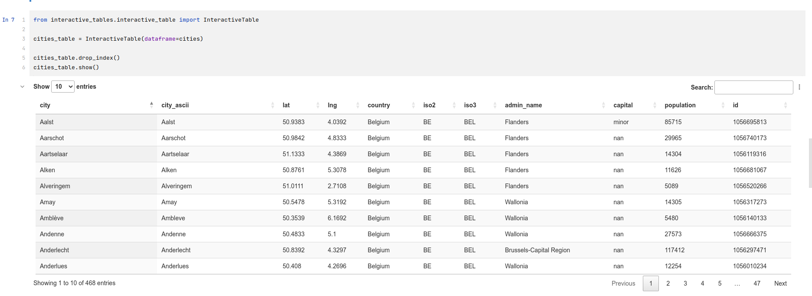
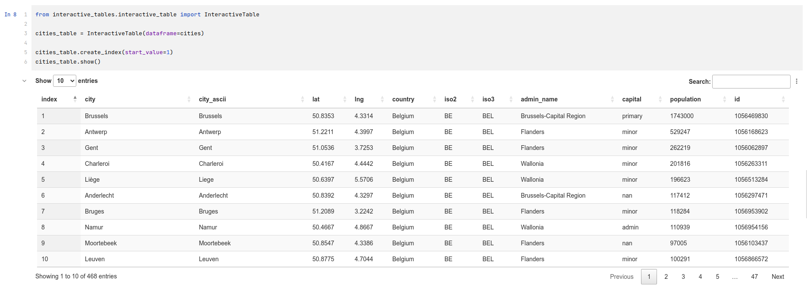
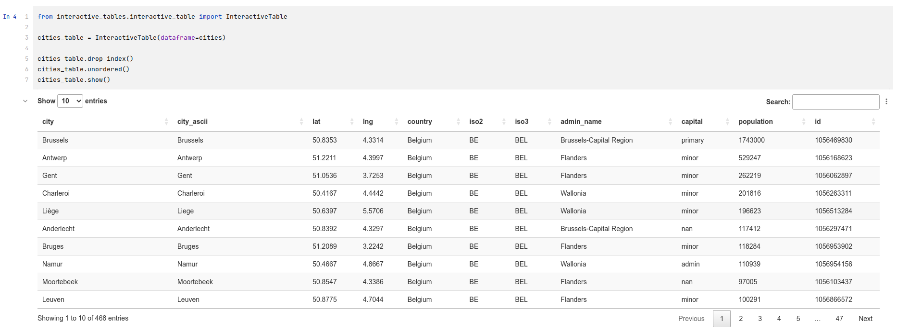
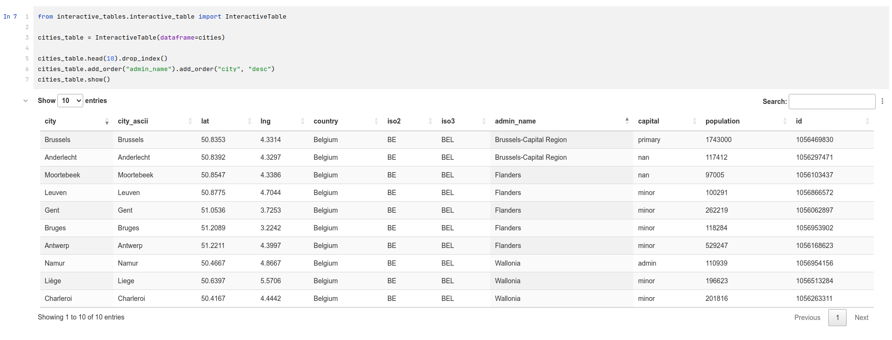

# 1 interactive_tables: iTables Configuration

## 1.1 Basic usage

### 1.1.1 Dataframe

In all the examples, the dataframe is built from the worldcities.csv file.  The dataframe contains the cities in Belgium.

### 1.1.2 Creating an instance

- First, you must import the InteractiveTable class.
- To render a dataframe with the interactive_tables, you must create an instance of the class InteractiveTable.
- To the constructor of the class, so when you create the instance of the class, you must pass the dataframe that needs to be shown.

See example in 1.1.2 show() method, lines 1 and 3.

### 1.1.3 show() method

- Create an instance of the class (see above).
- Alternatively, you can do more configuration (see later).
- You must call the show() method on the instance of your class.  The dataframe will be shown below the cell.

### 1.1.4 Named parameters vs positioned parameters

As you can see, the constructor of the InteractiveTable class takes one parameter: the dataframe.  *Note that I have used a named parameter in this example, but you can also use positioned parameters of course.*

### 1.1.5 Trusted notebooks

As iTables is actually written in Javascript, you could get a warning that you must trust your notebook first.  Depending on which tool you are using, there will be a different way to do this.  Please refer to your tool's manual for that.  But you should see something similar to the image below.

### 1.1.6 Shortcut method

If you want to simply show the content of a dataframe, and you need no further configuration, you may as well skip the assignment to a variable and call the show() method immediately on the class instance created.

## 1.2 Defaults of an Interactive Table

## 1.2.1 Defaults that make the behavior to show dataframes different from showing standard dataframes

- By default, **all the data is shown**.  Within, for example, Jupyter Lab, in a notebook when you show a dataframe, by default not all rows are shown, but with an interactive table, they are.  
- By default, **the rows are paginated** by 10 entries, and you can quickly scroll through it using the paging buttons below the table on the right.  You can change the number of rows per page changing the number of entries to show on the left above the table.  When you change this, the paging buttons are also changed automatically.
- By default, the index from the dataframe is shown.
- By default, **the data is sorted** ascending on the first column.  If you would hide the index, the data would be sorted on "city" in the example.
- By default, a **search box** is available above the table on the right, allowing a quick search on the content over each column.

## 1.2.2 Original dataframe

**It is important to know that the wrapper class make a deep copy of the dataframe into its own properties.  The original dataframe is never touched.**

## 1.3 Using the configurator

### 1.3.1 General rules

- In order to set the configuration parameters, the user must call a set of methods on the instance of the InteractiveTable class.
- Some of these methods have parameters, some have not.  Each method is listed below and for each of the methods, the parameters are listed also.
- These methods always return the class instance itself.  This allows "chaining" of methods.  You can call one method and immediately continue with another one, without an extra line of code.  Examples are given below.

### 1.3.2 Basic methods

#### 1.3.2.1 head() method

##### purpose

The head method can be used to limit the number of rows being show in the datatable.  This can be handy during development of your notebook when you don't always want the full dataframe to be loaded.  It results in a higher performance.  Afterwards, you can comment out this line to have all data for example.

**You cannot reverse this action.**  Within the InteractiveTable, the records that are not in the first x number of rows, are removed.  But as said before, you still have the original dataframe untouched.  If you need the full dataframe in a further cell, just re-use the original dataframe.

The rows are limited based on the dataframe rows as they are at that moment, so by default sorted on their index, unless you already did some sorting on the dataframe itself.

##### parameters

- **max_rows** (integer): number of rows maximum to show.  If there are fewer rows in the dataframe, this parameter has no impact.

##### example

#### 1.3.2.2 drop_index() method

##### purpose

The drop_index() method removes the index from the dataframe.  Often this index is not needed as it is generated by Pandas itself.  With this method, you drop the column "index" and the datatable will be sorted on the first column.

##### parameters

- None

##### example

#### 1.3.2.3 create_index() method

##### purpose

The create_index method can be used to create an index column in case you have dropped it, or it can be used to update the index column if with a new index starting at your desired number.

##### parameters

- **start_value** (optional, number, default = 0): the first index value.  This is for Europe where we start at 1 instead of the default 0

##### example

### 1.3.3 Ordering methods

#### 1.3.3.1 unordered() method

##### purpose

The unordered method can be used to show the table without any default ordering applied.  If not used, by default, the datatable will be ordered on the first column.

*Note: in the example, the index was dropped first.  Actually, when the dataframe comes in, the data is sorted on this index and it would give a distorted view of the functionality.*

##### parameters

- None

##### example

#### 1.3.3.2 add_order() method

##### purpose

The add_order method can be used to make the datatable sort the data on one or multiple columns.  By default, the sorting will be done on the first column and internally in the class this is "unspecified".  Calling this method for the first time, will override the default sort order.  Calling this method a second time, will add a sort order.  The datatable will first sort on the first add_order parameters, then on the second.  You can chain this to add more sorting.

**This does not sort the data in the dataframe.  So putting a head() after this method, will run on the unsorted dataframe**

##### parameters

- **column_name** (str): Name of the column to sort on
- **sort_order** (str, optional, default = "asc"): State if the sorting should be done ascending or descending.  The default is ascending.  Specify using "asc" and "desc".

##### example

